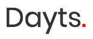
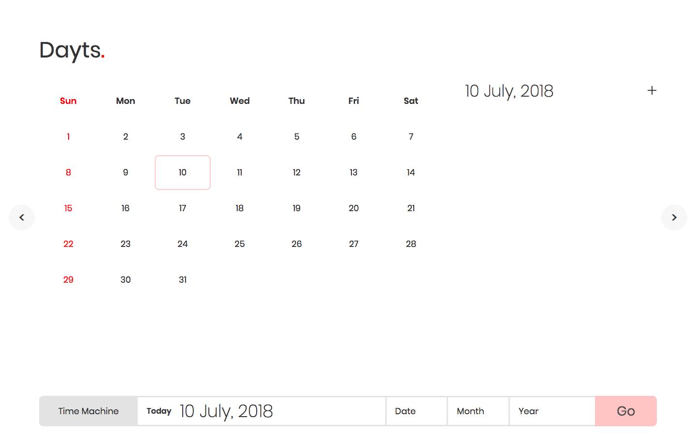
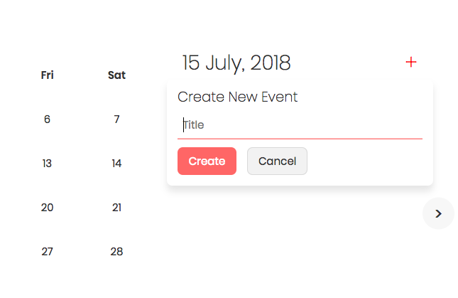
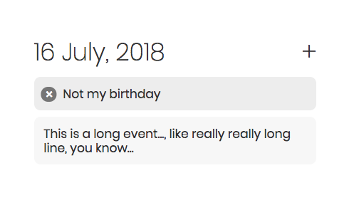

# 

> Web based calendar app made with react and redux

Check it out at [https://vrongmeal.github.io/dayts/](https://vrongmeal.github.io/dayts/)

1.  [Features](#features)
2.  [Todo](#todo)
3.  [Setup](#setup)
4.  [Screenshot](#screenshot)

## Features

- Go to any date (given year > 1752)
- Add events for any date, also can delete them

_More features to come, see [todo](#todo)_

## Todo

- [x] Add arrow buttons to navigate to adjascent months
- [x] Add option to create events and display them
- [ ] Add labels for events, make them editable

## Setup

1.  Clone the repository and `cd` into it
2.  Run `npm install` to install all the dependencies
3.  Start the server using `npm start`
4.  Browse to [`http://localhost:8080/`](http://localhost:8080/) and you're done!

## Screenshot

**Dayts Preview**

**Create Event Popup menu**

**Events List**

---

Made with **khoon**, **paseena** and **love** `:-)` by

[vrongmeal](https://vrongmeal.github.io) / [github](https://github.com/vrongmeal) / [vrongmeal@gmail.com](mailto:vrongmeal@gmail.com)
